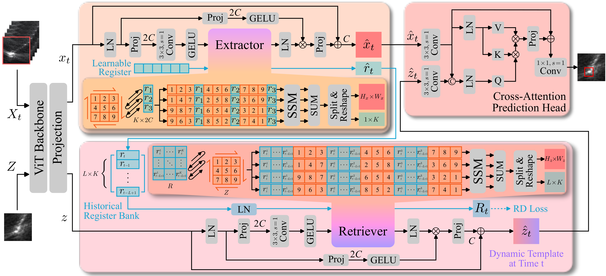

# <p align=center> MrTrack  </p>

<b><p align=center> Register Mamba for Needle Tracking with Rapid Reciprocating Motion during Ultrasound-Guided Aspiration Biopsy </p></b>

<b><p align=center> <a href='https://arxiv.org/abs/2505.09450'></a>
  MICCAI 2025 (Early Accepted) </p></b>


> **_MrTrack: Register Mamba for Needle Tracking with Rapid Reciprocating Motion during Ultrasound-Guided Aspiration Biopsy_** <br> Yuelin Zhang, Qingpeng Ding, Long Lei, Yongxuan Feng, Raymond Shing-Yan Tang, and Shing Shin Cheng<br>
> Medical Image Computing and Computer Assisted Intervention–MICCAI 2025 <br>


<summary> Structure overview of the proposed MrTrack </summary>
<div style="text-align: center;">
    
</div>


## 🔥 News
- **2025-06-23:** We release this repository.
- **2025-05-13:** Our paper is early accepted by MICCAI 2025.


## The code is coming soon...


## 📎 Citation
If you find our work helpful, please consider citing our paper:

MrTrack: (official link will be updated soon)
```
@article{zhang2025mrtrack,
  title={MrTrack: Register Mamba for Needle Tracking with Rapid Reciprocating Motion during Ultrasound-Guided Aspiration Biopsy},
  author={Zhang, Yuelin and Ding, Qingpeng and Lei, Long and Feng, Yongxuan and Tang, Raymond Shing-Yan and Cheng, Shing Shin},
  journal={arXiv preprint arXiv:2505.09450},
  year={2025}
}
```

