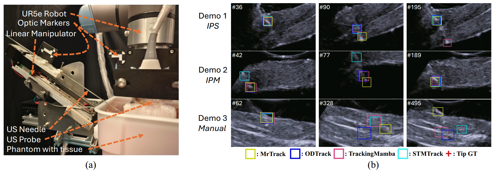

# <p align=center> MrTrack  </p>

<b><p align=center> Register Mamba for Needle Tracking with Rapid Reciprocating Motion during Ultrasound-Guided Aspiration Biopsy </p></b>

<b><p align=center> <a href='https://arxiv.org/abs/2505.09450'></a>
  MICCAI 2025 (Early Accepted) </p></b>


> **_MrTrack: Register Mamba for Needle Tracking with Rapid Reciprocating Motion during Ultrasound-Guided Aspiration Biopsy_** <br> Yuelin Zhang, Qingpeng Ding, Long Lei, Yongxuan Feng, Raymond Shing-Yan Tang, and Shing Shin Cheng<br>
> Medical Image Computing and Computer Assisted Intervention–MICCAI 2025 <br>


<summary> Structure overview of the proposed MrTrack </summary>
<div style="text-align: center;">
    
</div>

We proposed a novel Mamba-based tracker with register extract-retrieve paradigm to track the needle with rapid reciprocating motion (fast back and forth motion).


## 🔥 News
- **2025-05-13:** Our paper is early accepted by MICCAI 2025.
- **2025-06-23:** We release this repository.
- **2025-09-21:** We release the code.


## ⚙️ Dependencies

### Initialize Conda Environment and Clone Repo
```bash
git clone https://github.com/PieceZhang/MrTrack
conda create -n mrtrack python=3.11
conda activate mrtrack
# If necessary, Replace pytorch-cuda=? with the compatible version of your GPU driver.
conda install pytorch==2.0.0 torchvision==0.15.1 torchaudio==2.0.1 pytorch-cuda=11.8 -c pytorch -c nvidia
```


### Install
```bash
pip install -r requirements.txt
python setup.py build_ext --inplace  # Build extensions
```


## 🏃 Train

### Download pretrained backbones
Download pretrained ViT-B16 model and put them in `pretrained_models` directory.
```bash
wget https://storage.googleapis.com/vit_models/imagenet21k/ViT-B_16.npz
```

### Train
```bash
cd ./experiments/mrtrack
export PYTHONPATH=$PYTHONPATH:/path/to/siamban
python -m torch.distributed.launch \
    --nproc_per_node=4 \
    --master_port=2333 \
    ../../tools/train.py --cfg config.yaml
# This is a command to train the model with 4 GPUs. Modify the code according to your GPU settings.
```


## 🏃‍♂️ Test
The model weight can be downloaded at [here](https://drive.google.com/file/d/1-OzXYPDyShQt4H22A3It8AqBV2CqAXOg/view?usp=sharing).
Put the weight in `experiments/mrtrack` directory.

### Tracking Demo
```bash
python tools/test.py
```

### Evalutation

```bash
cd /experiment/mrtrack
python ../../tools/eval.py --dir /path/to/your/rawdataset
```


## 🔍 Results

<summary> Left: Experiment setup.
Right: Tracking demonstration.  </summary>
<div style="text-align: center;">
    
</div>


## 📎 Citation
If you find our work helpful, please consider citing our paper:

MrTrack: (official link will be updated soon)
```
@article{zhang2025mrtrack,
  title={MrTrack: Register Mamba for Needle Tracking with Rapid Reciprocating Motion during Ultrasound-Guided Aspiration Biopsy},
  author={Zhang, Yuelin and Ding, Qingpeng and Lei, Long and Feng, Yongxuan and Tang, Raymond Shing-Yan and Cheng, Shing Shin},
  journal={arXiv preprint arXiv:2505.09450},
  year={2025}
}
```

